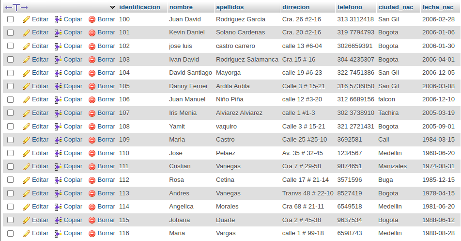
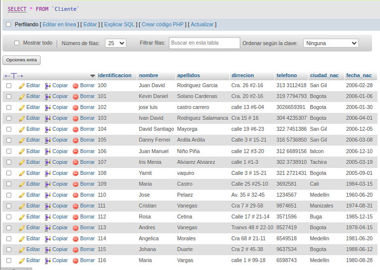
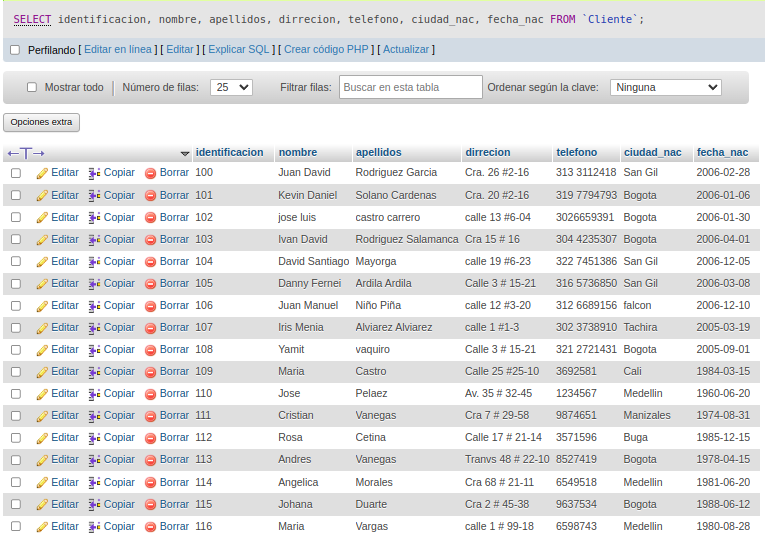
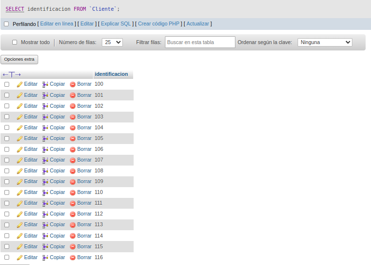
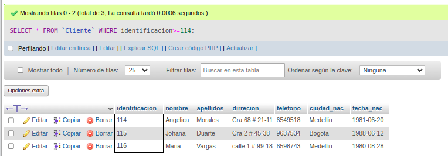
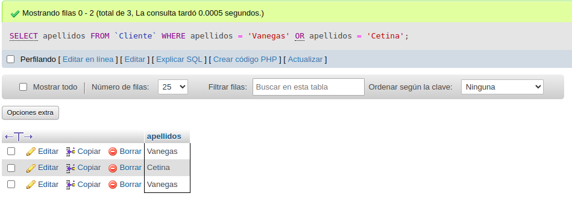
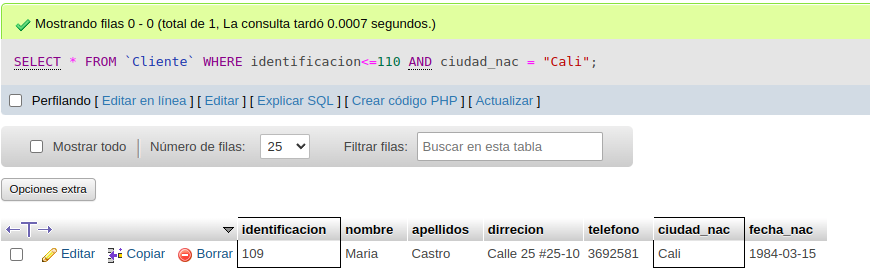

# CONSULTAS_SQL_1
# INtroduccion a las consultas a una BD usando el lenguaje SQL 

## Base de datos: Ventas 
## Tabla: Cliente 

## Instruccion SELECT
- permite seleccionar datos de una tabla.
-su formato es: 'SELECT campos_tablas FROM nombre_tabla''

### Consulta No. 1
1. Para visualizar toda la informacion que contiene la tabla Cliente se puede incluir con la instruccion SELECT el caracter **\*** o cada uno de los campos de la tabla.

- 'SELECT * FROM cliente'

- 'SELECT identificacion, nombre, apellidos, direccion, telefono, ciudad_nac, fecha_nac FROM Cliente'

### Consulta No. 2

2. Para visualizar solamente la identificacion del Cliente: 'SELECT identificacion FROM Cliente'

### Consulta No.3

3. si se desea obtener los registros cuya identificacion sea mayor o igual a 150, se debe utilizar la clausula 'WHERE' que especifica las condiciones que deben reunir los registros que se van a seleccionar: 'SELECT * FROM Cliente WHERE identificacion>=150

### Consulta No. 4 

4. Sedesea obtener los registros cuyos apellidos sean vanegas o cetina, se debe utilizar el operador IN que especifica los registros que se quieren visualizar de una tabla.

'SELECT apellidos FROM Cliente WHERE apellidos IN('Vanegas', 'Cetina')

.png)

O se puede utilizar el operador 'OR'

'SELECT apellidos,nombre FROM Clientes WHERE apellidos = 'Vanegas' OR apellidos = 'Cetina'

### Consulta No. 5

5. Se a menor que 110 y la ciudad sea cali, se debe utilizar el operador 'AND' 

'SELECT * FROM Clientes WHERE identificacion<=110 AND ciudad_nac = 'Cali'

### Consulta No. 6 

6. Si se desea obtener los registros cuyos nombres empiecen por la letra 'A', se debe utilizar el operador 'LIKE' que utiliza los patrones '%' (todos) y '_' (Caracter).

'SELECT * FROM Clientes WHERE nombre LIKE 'A%'

.png)

### Consulta No. 7

7. Se desea obtener los registros cuyos nombres contengan la letra 'a'

'SELECT * FROM cliente WHERE nombre LIKE '%a%'

.png)
